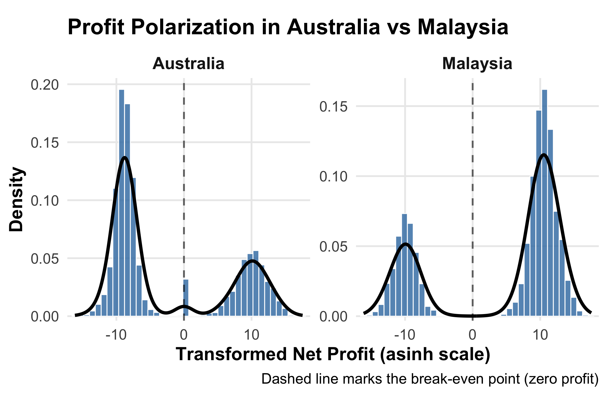
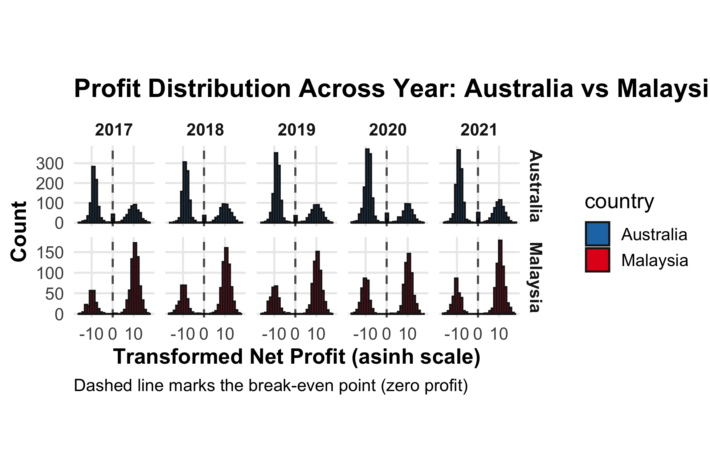

::: {.report-article}
::: {.report-lede}
Listed companies in the Australian and Malaysian samples entered the pandemic with very different financial distributions. Malaysian firms remained concentrated around positive operating margins and stable balance-sheet ratios. The Australian sample contained a much larger loss-making and near-break-even group, with the weakest median profitability in 2020. The contrast is large, but it must be interpreted as a difference between the observed OSIRIS samples rather than a verdict on the two national economies.
:::

::: {.executive-summary}
## Executive summary

- **Malaysia’s median EBITDA margin stayed between roughly 10.5% and 12.5% from 2017 to 2021.** Its median EBIT and return on assets dipped in 2020 and recovered in 2021.
- **Australia’s sample was far more dispersed and loss-heavy.** Median profit margin fell from about −25% in 2017 to about −75% in 2020; median EBITDA margin reached roughly −50%.
- **The balance-sheet story was calmer than the profit story.** Median current ratios remained healthy in both samples, and median leverage did not rise sharply during the pandemic.
:::

## Research question and design

The project asks how the pandemic’s financial impact differed between Australian and Malaysian public companies. It uses Bureau van Dijk’s OSIRIS database for fiscal years 2017–2021, giving three pre-pandemic years and two pandemic-era years.

Financial ratios are more comparable across currencies and company sizes than raw totals, so the analysis focuses on profit margin, EBITDA and EBIT margins, returns on assets and equity, current ratio, leverage, solvency and net-assets turnover. Duplicate company-year records were removed, implausible denominators were excluded and ratios were recalculated from base fields where possible. Because the distributions have long tails, medians and median absolute deviations describe the centre and spread.

::: {.metric-grid}
::: {.metric-card}
::: {.metric-value}
2017–2021
:::
::: {.metric-label}
fiscal-year coverage in the comparative panel
:::
:::
::: {.metric-card}
::: {.metric-value}
10.5–12.5%
:::
::: {.metric-label}
Malaysia’s median EBITDA margin range
:::
:::
::: {.metric-card}
::: {.metric-value}
≈2.0
:::
::: {.metric-label}
Malaysia’s stable median current ratio
:::
:::
:::

## Profitability separates the two samples

Malaysia’s median profitability is stable and generally positive. Median return on assets moves from about 3.2% in 2017 to a low near 1.5% in 2020, then begins to recover. Median EBIT margin falls from roughly 9% to 6% before rebounding in 2021, while the EBITDA margin barely moves. That combination suggests that the 2020 squeeze was more visible after depreciation, amortisation and related charges than in cash-oriented operating earnings.

Australia’s central estimates are much lower and the dispersion is wider. Median profit margin declines to about −75% in 2020 and median EBITDA margin to roughly −50%, followed by only a partial recovery. These extreme sample medians warrant caution: they may reflect the industry mix and coverage of the listed firms retained after cleaning, as well as genuine operating performance.

{#fig-profit-polarisation fig-alt="Two density plots showing a wider loss-making and near-zero cluster in Australia and a tighter positive cluster in Malaysia."}

The transformed distributions reveal a pattern that a single median misses. Both countries contain profitable firms, but Australia has a substantial negative cluster and a dense group near zero. Malaysia is more concentrated on the positive side. The transformation compresses the scale, so horizontal distances should be read as distributional structure rather than literal currency differences.

## The 2020 shock amplified an existing Australian tail

The annual view shows that the Australian low-profit cluster was already present before COVID-19. It thickens in 2020 rather than appearing from nowhere. Malaysia’s distribution remains more concentrated on the profitable side throughout the five years.

{#fig-profit-years fig-alt="Faceted annual density plots showing profit distributions in Australia and Malaysia from 2017 through 2021."}

This changes the interpretation of the pandemic. For Malaysia, 2020 looks like a temporary earnings interruption within a stable operating and financing profile. For Australia, the pandemic intensified a pre-existing divide between profitable firms, firms around break-even and firms reporting losses.

## Liquidity and leverage remained comparatively stable

Malaysia’s median current ratio stays close to 2.0, meaning the typical observed firm held about twice as many current assets as current liabilities. Australia’s median is also above 2 in much of the period, although its spread is wider. Median leverage is close to one third in both groups and falls slightly by 2021; median solvency remains above 60%.

Asset efficiency produces another clear contrast. Malaysia’s median net-assets turnover declines from about 0.61 in 2017 to 0.53 in 2020. Australia begins around 0.32 and reaches about 0.23 in 2020. Both samples become less efficient in the shock year, but the Australian level is lower throughout.

## Interpretation and limits

The most defensible conclusion is about financial risk profiles in these two cleaned samples. Malaysian firms cluster more tightly around positive margins and stable liquidity. Australian firms show a broader range of outcomes and a large loss-making segment, with 2020 worsening an already weak distribution.

This is exploratory evidence, not a causal estimate of COVID-19. OSIRIS coverage and missingness differ by country and industry; the sample contains listed companies only; interpolation and ratio reconstruction can affect the distributions; and there is no matched counterfactual for what performance would have been without the pandemic. A stronger causal design would match firms by industry and size, track a balanced panel and test whether changes around 2020 differ after controlling for prior trends.

::: {.technical-appendix}
## Technical appendix and original group report

The complete report includes missing-data analysis, the ratio dictionary, industry comparisons, correlation matrices, interactive charts, spatial maps and the full cleaning workflow.

::: {.assignment-actions}
[Read the complete original report](report.html){.btn .btn-primary target="_blank"}
[View the source repository](https://github.com/etc5521-2025/project-part-1-emu){.btn .btn-outline-secondary target="_blank"}
:::
:::
:::
