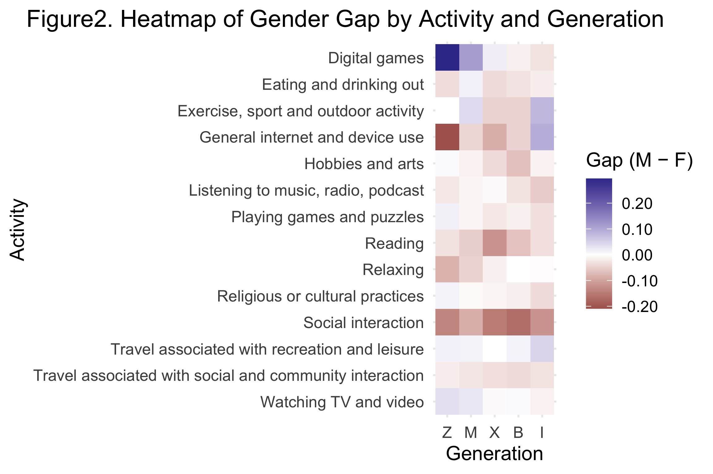
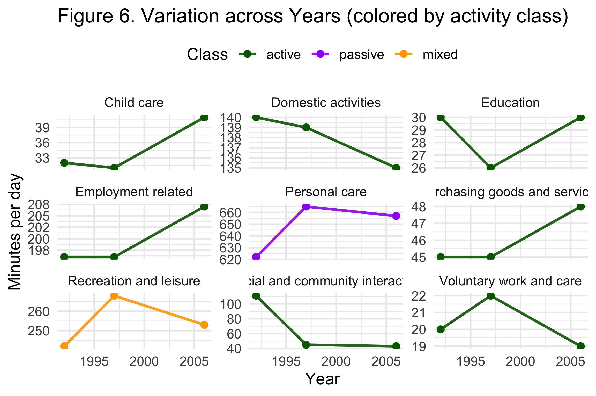

::: {.report-article}
::: {.report-lede}
Australians do not share one typical leisure routine. Age and gender shape which activities people choose, but the pattern changes from one activity to another. Digital gaming shows the clearest male advantage among younger people, reading and social interaction lean female, and older cohorts participate more in several passive activities. Historical time-use data also suggest that social and community interaction lost ground between 1992 and 2006.
:::

::: {.executive-summary}
## Executive summary

- **The largest visible gender gap is in digital gaming.** Among Generation Z, male participation is about 30 percentage points higher than female participation; the gap narrows in older cohorts.
- **Age does not divide leisure into two simple camps.** Digital gaming declines sharply with age, while reading and several home-based activities become more common. Exercise and social interaction are comparatively stable across cohorts.
- **The long-run comparison points to a reallocation of time.** In the three historical snapshots, social and community interaction fell from about 110 minutes per day in 1992 to roughly 45 minutes in 1997 and 2006, while employment and child-care time increased.
:::

## The question

This study asks how leisure participation differs across Australian generations and between men and women. It also asks whether activities form a common “leisure mix” and whether the 2022 cross-section fits the longer history of Australian time use.

The main evidence comes from the Australian Bureau of Statistics 2022 leisure tables. Five cohorts are compared: Generation Z, Millennials, Generation X, Baby Boomers and the Interwar generation. Participation is the share of a group reporting an activity; time is measured in minutes. A second ABS dataset supplies national snapshots for 1992, 1997 and 2006.

::: {.metric-grid}
::: {.metric-card}
::: {.metric-value}
5 cohorts
:::
::: {.metric-label}
compared by activity and gender in the 2022 data
:::
:::
::: {.metric-card}
::: {.metric-value}
≈30 pp
:::
::: {.metric-label}
Gen Z male advantage in digital-game participation
:::
:::
::: {.metric-card}
::: {.metric-value}
3 years
:::
::: {.metric-label}
in the historical time-use comparison: 1992, 1997 and 2006
:::
:::
:::

## Gender differences depend on the activity

The heat map reports the male participation rate minus the female rate. Red cells indicate higher male participation and blue cells higher female participation. A value near zero means that participation is similar.

{#fig-leisure-gender-gap fig-alt="A heat map comparing male minus female leisure participation across five Australian generations and multiple activities."}

Digital gaming stands out: the male advantage is largest among Generation Z and then contracts across older cohorts. Watching television and videos also tends to lean male, although the gap is smaller. Reading, hobbies and arts, relaxing, religious or cultural practice, and social interaction generally lean female.

The mixed cells matter as much as the strong ones. Exercise moves around parity across cohorts, and eating or drinking out does not show a consistent gender direction. Gender therefore predicts some leisure choices well, but it is not a single ranking that applies to every age group.

## Generational change is selective

The 2022 comparison shows a steep age gradient for digital games: participation is around one fifth among Generation Z and falls to the low single digits among older cohorts. Reading moves in the opposite direction, rising from roughly one in ten younger respondents to close to one half of the Interwar cohort. General internet and device use is highest among younger people, while hobbies, arts, radio and puzzles become more prominent in older groups.

Exercise, sport and outdoor activity do not collapse with age in the way the digital categories do. Social interaction also remains comparatively stable. This weakens any simple claim that young people are “active” and older people “passive.” The evidence supports a change in the composition of leisure, with some activities strongly age-graded and others shared more evenly.

::: {.report-note}
The “active” and “passive” labels are analytical groupings created for this assignment. Digital games were placed in the active group in the original analysis, even though other classifications are possible. The activity-level results are therefore more reliable than a broad active-versus-passive total.
:::

## Time use changed well before 2022

The historical comparison puts the cohort findings in context. It covers three survey years rather than a continuous annual series, so it shows large shifts between snapshots rather than a precise trend line.

{#fig-leisure-history fig-alt="Small multiple line charts comparing minutes per day for major activities in 1992, 1997 and 2006."}

Several changes are visible. Employment-related time rose from about 197 to 207 minutes per day. Child care increased from roughly 32 to 41 minutes, and personal care also rose. Recreation and leisure peaked near 268 minutes in 1997 before returning to about 252 minutes in 2006. The sharpest shift is social and community interaction, which fell from around 110 minutes in 1992 to about 45 minutes in both later surveys.

These figures describe population averages. They do not show that the same individuals replaced social time with work or care, and survey design or activity coding may also have changed. They do show that the social setting around leisure was already changing long before the 2022 cohort comparison.

## What the evidence says

Australian leisure is structured by both life stage and gender, but no single divide explains the whole pattern. Digital participation produces the clearest generational and gender contrasts. Reading and several home-based pursuits become more common in older cohorts, while exercise and social interaction are more widely shared. The historical evidence adds a broader shift: less recorded time in social and community interaction and more time in employment, care and personal activities.

The next analytical step would be to separate age, period and cohort effects using repeated surveys with consistent definitions. The current data cannot tell whether Generation Z will retain its present habits as it ages, or whether its leisure will come to resemble today’s older cohorts.

::: {.technical-appendix}
## Technical appendix and original submission

The original submission contains the full data-cleaning workflow, activity definitions, tables, correlation analysis and R code. It remains available for readers who want to audit or reproduce the work.

::: {.assignment-actions}
[Read the complete original report](report.html){.btn .btn-primary target="_blank"}
[View the source repository](https://github.com/shaocaoyu-01/Australians-spare-time-usage-report){.btn .btn-outline-secondary target="_blank"}
:::
:::
:::
