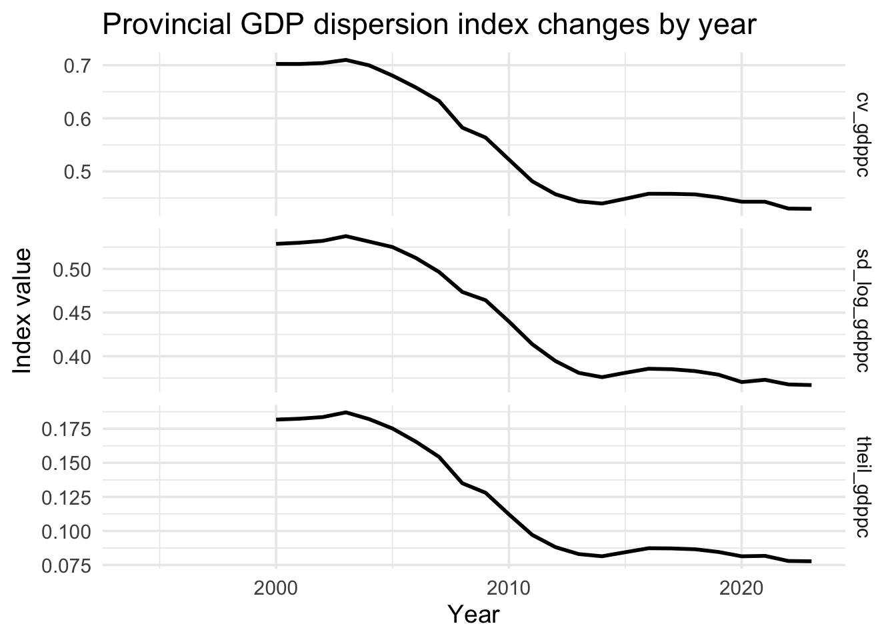
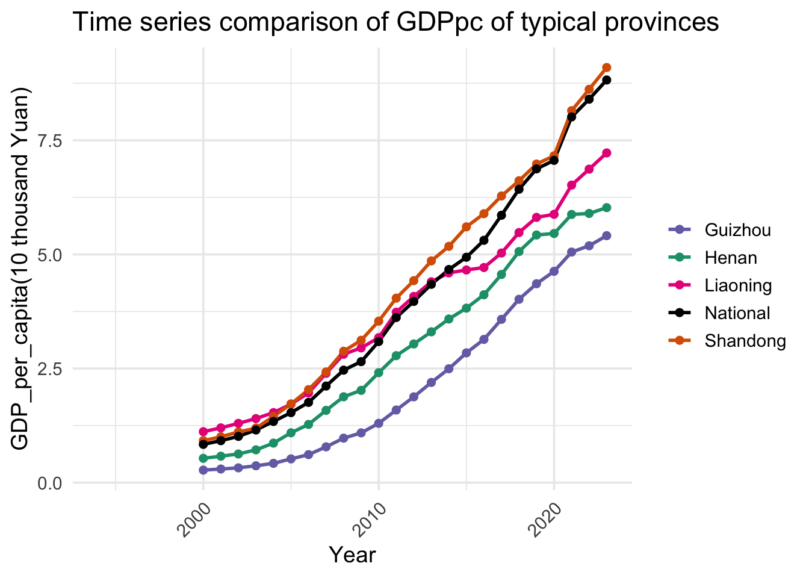

::: {.report-article}
::: {.report-lede}
China’s provincial economies became more similar in GDP per person through much of the 2000s and early 2010s. Three dispersion measures decline together, and a panel model finds that provinces starting from a lower income level subsequently grew faster. Convergence is real in the observed data, but it is incomplete: the decline in dispersion slows in the later years and large regional gaps remain.
:::

::: {.executive-summary}
## Executive summary

- **All three inequality measures—coefficient of variation, standard deviation of log GDP per capita and the Theil index—decline over the main study period.** The sharpest convergence occurs before the mid-2010s.
- **The panel estimate supports conditional beta convergence.** Lagged log GDP per capita has a coefficient of −0.698 in the fitted model (`p < 0.001`), meaning lower-income provinces tend to grow faster after the included controls.
- **Industrial structure and trade openness are positively associated with growth.** Urbanisation, education share and fixed-asset investment growth are not statistically distinguishable from zero in this specification.
:::

## The economic question

The project tests two competing stories. A cumulative-advantage or “Matthew effect” would allow already-rich coastal provinces to pull ever farther ahead. Convergence would mean that provinces with lower starting income grow faster and that the cross-provincial distribution of GDP per person becomes less dispersed.

The dataset joins provincial GDP and population with measures of secondary and tertiary industry, urbanisation, trade, education spending and fixed-asset investment. GDP per capita is the central outcome because total provincial GDP is strongly affected by population and administrative boundaries. The analysis combines time-series comparisons, regional maps, dispersion indices and fixed-effects regression.

::: {.metric-grid}
::: {.metric-card}
::: {.metric-value}
−0.698
:::
::: {.metric-label}
coefficient on lagged log GDP per capita in the panel model
:::
:::
::: {.metric-card}
::: {.metric-value}
1.103
:::
::: {.metric-label}
estimated coefficient on trade share (`p < 0.01`)
:::
:::
::: {.metric-card}
::: {.metric-value}
3 measures
:::
::: {.metric-label}
of provincial dispersion point in the same direction
:::
:::
:::

## Dispersion fell across several definitions

No single inequality index determines the conclusion. The report calculates the coefficient of variation in GDP per capita, the standard deviation of log GDP per capita and the Theil index. Each measure responds differently to the distribution, yet all three fall substantially before flattening in the later years.

{#fig-china-dispersion fig-alt="Three line charts showing declining provincial GDP per capita dispersion, followed by a later plateau."}

The common direction strengthens the case for sigma convergence: the provincial distribution became less unequal. The later plateau is equally important. It suggests that the rapid catch-up phase did not continue at the same pace and that remaining gaps may be harder to close.

## Catch-up did not produce one uniform path

Representative provinces show how convergence can coexist with very different trajectories. Coastal Shandong remains above the national series, central Henan follows a steadier middle path, Guizhou accelerates from a lower base and Liaoning’s relative position weakens.

{#fig-china-provinces fig-alt="Lines comparing GDP per capita in Guizhou, Henan, Liaoning, Shandong and the national series from 2000 to 2023."}

The figure shows why convergence should not be confused with equality. Provincial levels remain separated, and provinces reach the national path through different mixes of industrial change, investment, migration and trade exposure.

## The growth model supports conditional convergence

The fixed-effects model relates provincial GDP-per-capita growth to the previous year’s log GDP per capita and the available controls. The lagged-income coefficient is −0.698 (`p < 0.001`). Its negative sign is the standard beta-convergence result: after accounting for the modelled characteristics, provinces with higher starting income tend to grow more slowly.

The ratio of secondary- to tertiary-industry growth is positive at 0.308 (`p < 0.001`), and trade share is positive at 1.103 (`p < 0.01`). The estimated coefficients for urbanisation (0.004, `p = 0.114`), education share (−0.557, `p = 0.529`) and fixed-asset investment growth (0.00024, `p = 0.119`) do not meet the conventional 5% significance threshold.

These estimates describe conditional associations within the assembled panel. They do not prove that changing industrial composition or trade share by one unit would mechanically cause the stated growth change.

## Why convergence may have occurred

Several mechanisms are consistent with the pattern. Labour migration can raise output in receiving provinces while increasing capital and land per remaining worker in sending provinces. Industrial transfer and infrastructure investment can spread productive capacity inland. National programmes aimed at central and western development may also reduce geographic barriers to growth.

The analysis does not identify the contribution of each mechanism. It instead shows the outcome they would need to explain: broad catch-up, strong enough to reduce dispersion, followed by a slower phase in which persistent coastal–inland differences remain.

## Limits and conclusion

The controls do not share the same time coverage. Fixed-asset investment growth is available only for 2018–2023, urbanisation begins in 2005 and other series begin in different years. Complete-case estimation can therefore concentrate the regression on a shorter and selected period. Provincial price differences, revisions to official statistics and spatial dependence are also outside the model.

Within those limits, the descriptive and regression evidence agree: provincial GDP per capita converged, particularly during the earlier part of the study period. The most useful policy question is now less whether catch-up happened and more why it slowed—and which remaining regional constraints prevent the next stage.

::: {.technical-appendix}
## Technical appendix and original submission

The complete report preserves the variable dictionary, data joins, maps, animation, collinearity checks, model output and source discussion.

::: {.assignment-actions}
[Read the complete original report](Assignment4.html){.btn .btn-primary target="_blank"}
[Open the provincial animation](china_gdp_per_capita.gif){.btn .btn-outline-primary target="_blank"}
[View the source repository](https://github.com/shaocaoyu-01/Report-on-China-Provincial-development){.btn .btn-outline-secondary target="_blank"}
:::
:::
:::
