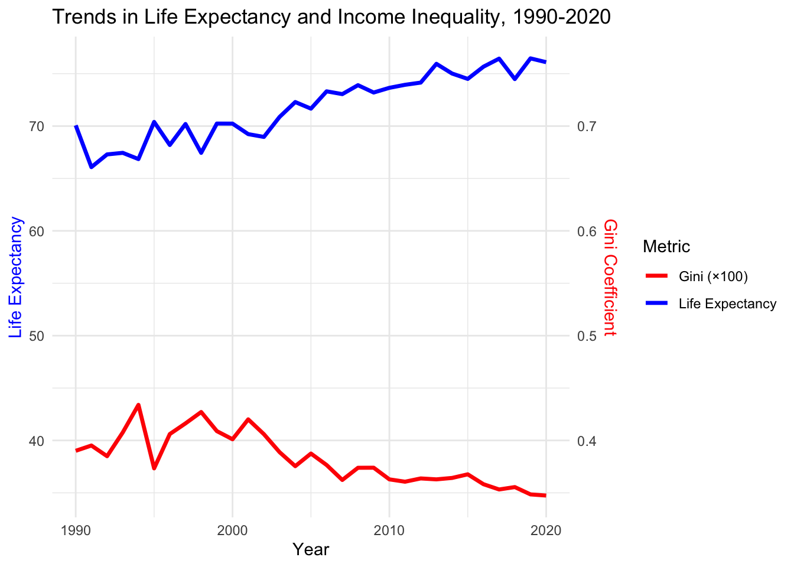
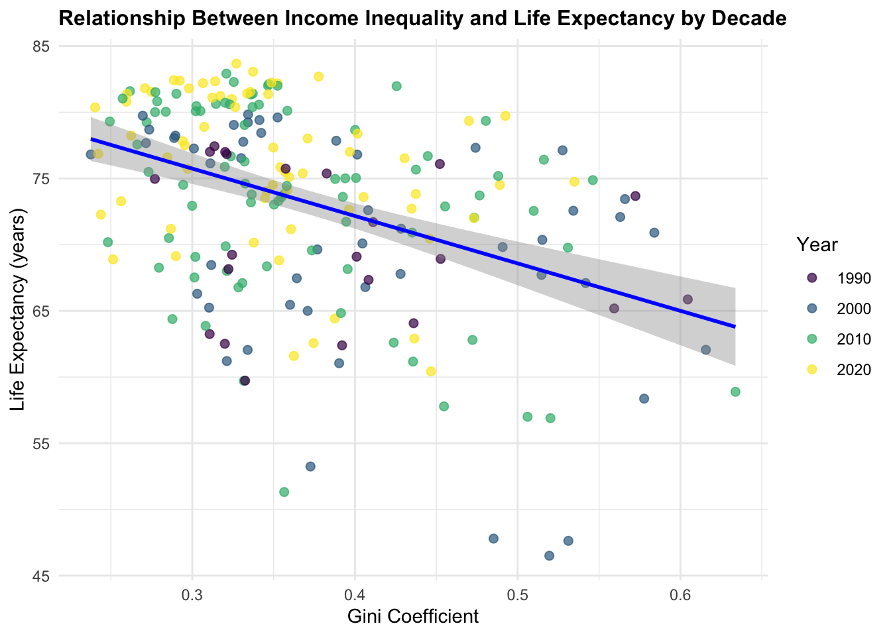

::: {.report-article}
::: {.report-lede}
Across the country-year observations in this study, higher income inequality is associated with shorter life expectancy. The relationship is meaningful but incomplete: the correlation is −0.45, and countries with similar inequality still have very different health outcomes. Inequality belongs in the explanation of longevity, alongside national income, health systems, education, conflict, geography and public policy.
:::

::: {.executive-summary}
## Executive summary

- **Life expectancy and the Gini coefficient have a moderate negative correlation of −0.45** in the matched country-year data.
- **Average life expectancy rose by about six years**, from roughly 70 in 1990 to 76 in 2020, while the mean Gini coefficient declined from approximately 0.39 to 0.35.
- **The association persists across the four decade snapshots**, but the wide spread of countries around the fitted lines shows that inequality alone cannot explain longevity.
:::

## Research question and evidence

The study asks whether countries with more equal income distributions tend to have longer life expectancy, and whether that relationship changes between 1990 and 2020. It combines life-expectancy data from Our World in Data with Gini-coefficient data published through the World Bank and Our World in Data. Country and year form the join key; unmatched and missing observations are removed.

The Gini coefficient ranges from zero, representing complete equality, to one, representing maximum inequality. Life expectancy at birth estimates how long a newborn would live if current mortality rates continued. In the assembled data, mean life expectancy is 72.82 years with a standard deviation of 7.84; the mean Gini coefficient is 0.38 with a standard deviation of 0.09.

::: {.metric-grid}
::: {.metric-card}
::: {.metric-value}
−0.45
:::
::: {.metric-label}
correlation between Gini and life expectancy
:::
:::
::: {.metric-card}
::: {.metric-value}
72.82 years
:::
::: {.metric-label}
mean life expectancy in the matched data
:::
:::
::: {.metric-card}
::: {.metric-value}
1990–2020
:::
::: {.metric-label}
study period across available country-year observations
:::
:::
:::

## Longevity rose as average inequality eased

The global annual averages move in favourable directions over the study period. Mean life expectancy rises from about 70 years in 1990 to about 76 in 2020. Mean Gini declines more modestly, from around 0.39 to 0.35.

{#fig-life-trends fig-alt="Two lines showing rising average life expectancy and a modest decline in the average Gini coefficient from 1990 to 2020."}

These are averages over the countries observed in each year. Changes in data availability can alter the country mix, so the lines should not be interpreted as a perfectly balanced global panel. They nevertheless show that longer lives and slightly lower measured inequality occurred together over these three decades.

## The negative relationship persists across decades

The cross-sectional snapshots for 1990, 2000, 2010 and 2020 all slope downward. Low-Gini observations are concentrated at higher life expectancy, while many high-Gini observations fall below 70 years. In the original summary, countries below a Gini of 0.30 often exceed 80 years of life expectancy, whereas countries above 0.45 frequently fall below 70.

{#fig-life-scatter fig-alt="Four scatter plots for 1990, 2000, 2010 and 2020 showing a negative relationship between Gini coefficient and life expectancy."}

The scatter is also central to the finding. At almost every inequality level, countries span several years of life expectancy. The fitted relationship is therefore a population-level tendency, not a prediction that all countries with the same Gini will have the same health outcome.

## How to interpret the association

Several mechanisms could connect inequality to longevity. Unequal societies may provide less consistent access to preventive care, safe housing, nutrition and education. Larger economic gaps can also increase chronic stress and weaken social trust. Public investment may be distributed differently where political influence and resources are concentrated.

The data in this project do not test those mechanisms directly. Income per person is an especially important omitted factor: richer countries often combine lower inequality with stronger health infrastructure, while conflict and infectious-disease burdens can lower life expectancy independently of inequality. Reverse causation and measurement differences are also possible.

::: {.report-note}
The correlation pools repeated observations of countries over time. Standard correlation treats those rows as independent and does not separate differences between countries from changes within the same country. A panel model with country and year effects would provide a stronger test.
:::

## Conclusion

Lower inequality is associated with longer life expectancy in the matched 1990–2020 data, and the pattern is visible in every decade snapshot. The result supports treating distribution as part of population health, but it does not show that a specific reduction in the Gini coefficient will cause a specific gain in life expectancy.

A stronger follow-up would use a balanced country panel, control for national income, health expenditure, education and region, and test lagged changes within countries. That design would distinguish whether improving equality predicts later health gains after accounting for the broader development path.

::: {.technical-appendix}
## Technical appendix and original group report

The submitted report contains the cleaning and merge code, statistical table, additional country comparison, discussion and references. Both HTML and PDF versions are preserved.

::: {.assignment-actions}
[Read the complete HTML report](Assignment-3.html){.btn .btn-primary target="_blank"}
[Download the submitted PDF](Assignment-3.pdf){.btn .btn-outline-primary target="_blank"}
[View the source repository](https://github.com/shaocaoyu-01/report-between-life-expectation-and-Gini-coefficient){.btn .btn-outline-secondary target="_blank"}
:::
:::
:::
