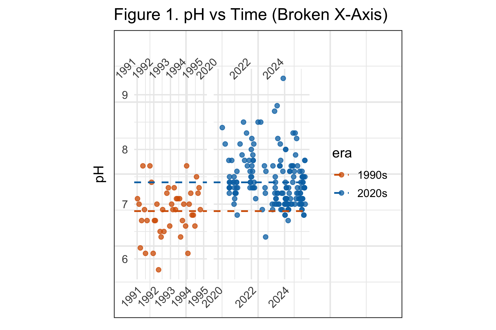
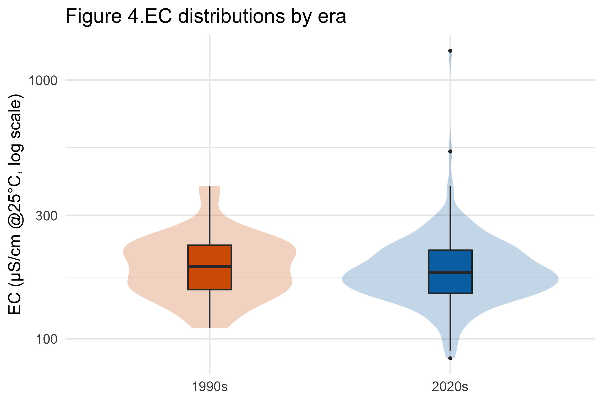
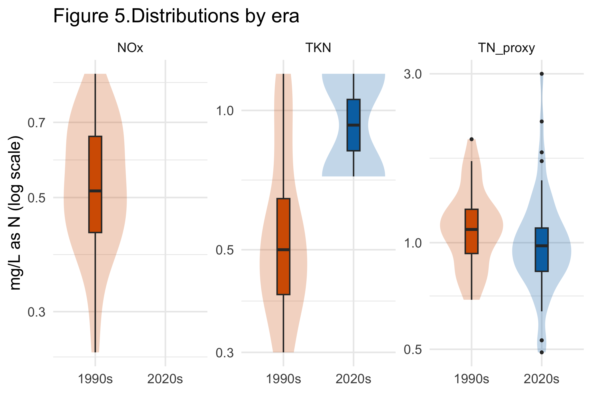

::: {.report-article}
::: {.report-lede}
The Yarra River monitoring record shows a clear rise in pH between the early 1990s and the 2020s. The other two comparable indicators tell a quieter story: electrical conductivity is slightly higher on average, while a reconstructed total-nitrogen measure is slightly lower. Their confidence intervals overlap. The evidence therefore supports a change in river chemistry, but not a broad claim that every aspect of water quality improved.
:::

::: {.executive-summary}
## Executive summary

- **pH provides the strongest evidence of change.** The estimated mean rose from 6.74–7.00 in the early 1990s to 7.33–7.46 in the 2020s, based on 95% confidence intervals.
- **Electrical conductivity did not clearly improve.** Its mean increased from 184 to 193 µS/cm at 25°C, with overlapping confidence intervals of 162–207 and 179–208.
- **Nitrogen moved slightly downward, with substantial uncertainty.** The total-nitrogen proxy fell from 1.12 to 1.05 mg/L as N; the two 95% confidence intervals also overlap.
:::

## The question and the monitoring record

The report asks whether water quality in the Yarra River changed over roughly three decades. The cleaned monitoring data contain many parameters, sites and dates, but not every measure is observed consistently in both periods. The defensible comparison is therefore narrower than the full database.

Three indicators had enough common coverage to examine:

1. **pH**, which describes acidity or alkalinity;
2. **electrical conductivity at 25°C (EC)**, a broad indicator of dissolved salts and ions; and
3. **nitrogen**, represented by observed total nitrogen or a proxy formed from nitrogen as NOx plus total Kjeldahl nitrogen when needed.

The analysis compares records from 1990–1994 with records from 2020–2025. It uses distributions, time plots and confidence intervals rather than relying on a single average.

::: {.metric-grid}
::: {.metric-card}
::: {.metric-value}
6.87 → 7.40
:::
::: {.metric-label}
approximate pH mean, from the midpoint of each reported interval
:::
:::
::: {.metric-card}
::: {.metric-value}
184 → 193
:::
::: {.metric-label}
mean EC in µS/cm at 25°C
:::
:::
::: {.metric-card}
::: {.metric-value}
1.12 → 1.05
:::
::: {.metric-label}
mean total-nitrogen proxy in mg/L as N
:::
:::
:::

## pH shifted upward

The pH observations are visibly higher in the 2020s than in the early 1990s. The estimated mean for the earlier period has a 95% confidence interval of 6.74–7.00; the corresponding interval for the 2020s is 7.33–7.46. Because these intervals do not overlap, pH is the clearest signal in the report.

{#fig-yarra-ph fig-alt="Scatter plots of Yarra River pH over time for the early 1990s and 2020s, showing higher values in the recent period."}

The result should be described as a shift toward more alkaline readings. Whether that is environmentally beneficial depends on site-specific guidelines, natural background conditions and biological responses; pH alone is not an overall water-quality score.

## Conductivity shows no clear improvement

Electrical conductivity is more variable in the recent observations. Its mean rises from 184 µS/cm in the 1990s to 193 µS/cm in the 2020s, and its standard deviation rises from 75 to 100. The 95% confidence intervals—162–207 and 179–208—overlap widely.

{#fig-yarra-ec fig-alt="Violin and box plots of electrical conductivity for the 1990s and 2020s."}

The box plots suggest a lower recent median even though the recent mean is slightly higher. That combination is consistent with a right-skewed distribution containing some large recent values. It is a useful example of why one statistic should not carry the conclusion: the typical observation may have shifted down, while high readings keep the mean elevated.

## Nitrogen is slightly lower, but the comparison is fragile

For nitrogen, the analysis combines total nitrogen where available with NOx plus total Kjeldahl nitrogen as a proxy. The mean is 1.12 mg/L as N in the 1990s and 1.05 in the 2020s. The reported 95% intervals are approximately 1.02–1.23 and 0.94–1.17, so the data are consistent with a modest decline as well as little change.

{#fig-yarra-nitrogen fig-alt="Faceted violin and box plots comparing nitrogen measures between the 1990s and 2020s."}

Only two recent total Kjeldahl nitrogen observations were available in the processed data. The proxy makes a comparison possible, but the result depends on how components were combined and on which dates contain the required measurements. It should be treated as indicative rather than definitive.

## What can—and cannot—be concluded

The evidence supports a clear rise in pH. It does not show a similarly clear improvement in conductivity, and the nitrogen decrease is small relative to its uncertainty. A balanced conclusion is that the Yarra’s measured chemistry differs between the two periods, with the strongest change in pH and mixed evidence elsewhere.

The comparison is observational. Monitoring sites, sampling frequency and parameter availability differ across decades, so a period difference can reflect changes in the monitoring network as well as changes in the river. A stronger follow-up would match sites and seasons, model repeated observations explicitly, and report guideline exceedances for each river reach.

::: {.technical-appendix}
## Technical appendix and original submission

The original report contains the site and parameter audit, data transformations, interactive summary tables, permutation line-ups and complete R workflow.

::: {.assignment-actions}
[Read the complete original report](report.html){.btn .btn-primary target="_blank"}
[View the source repository](https://github.com/shaocaoyu-01/Yarra_river-water-quality-report){.btn .btn-outline-secondary target="_blank"}
:::
:::
:::
